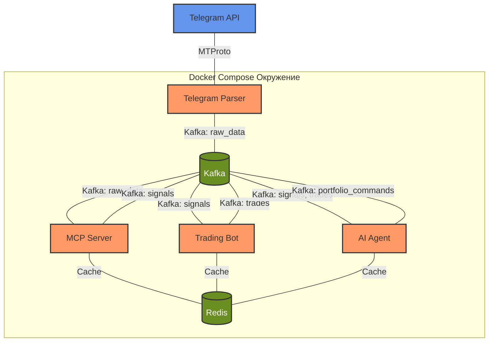
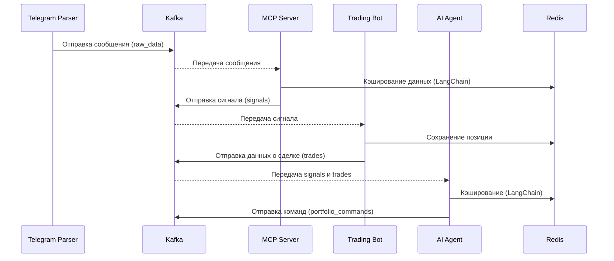

Хорошо, я уберу всё лишнее и неподходящее из архитектуры, оставив только то, что соответствует нашим предыдущим обсуждениям. Мы фокусировались на парсинге Telegram для трейдинга, анализе новостей, генерации торговых сигналов и интеграции с ботами/AI агентами через Kafka, с использованием LangChain для кэширования и агентных структур, базового логирования и Docker Compose. Я исключу элементы, которые не связаны с этой задачей (например, сложные авторизации, Webhook, MinIO S3, TypeScript MCP сервер), и оставлю только релевантные компоненты.

---

# Архитектура системы парсинга Telegram для трейдинга

## Схема архитектуры



## Общий подход

Система предназначена для:
- Парсинга новостей из Telegram-чатов с фильтрацией.
- Анализа данных (настроение, трендовые сигналы) в MCP Server.
- Генерации торговых сигналов для ботов.
- Управления портфелем через AI Agent.
- Асинхронной передачи данных через Kafka.

Компоненты:
1. **Telegram Parser** — собирает данные из Telegram и отправляет в Kafka.
2. **MCP Server** — анализирует данные и генерирует сигналы.
3. **Trading Bot** — выполняет сделки на основе сигналов.
4. **AI Agent** — управляет портфелем с использованием LangChain.

---

## Потоки данных



---

## Компоненты системы

### 1. Telegram Parser

**Задача**: Парсинг сообщений из Telegram-чатов с фильтрацией и отправка в Kafka.

**Библиотеки**:
- `telethon==1.36.0` — работа с Telegram API.
- `kafka-python==2.0.2` — отправка в Kafka.
- `python-dotenv==1.0.1` — переменные окружения.
- `loguru==0.7.2` — базовое логирование.

**Фильтры**:
- **Максимальный размер файла**: `MAX_FILE_SIZE` (например, 10 МБ).
- **Расширение файла**: Список расширений (`.jpg`, `.pdf`).
- **Тип файла**: Фото, документы, видео (`message.media`).
- **Поиск по хэштегам**: `#BTC`, `#ETH` (регулярные выражения).
- **Поиск по ключевым словам**: "покупка", "рост".
- **Парсинг коллажа фото**: Обработка `grouped_id`.
- **Диапазон дат и времени**: `offset_date`.
- **Список чатов**: `chat_ids` из конфига.
- **От кого сообщение**: Фильтр по `sender_id`.

**Реализация**:
- Подключение через `Telethon`.
- Итерация по чатам с фильтрацией сообщений.
- Отправка в Kafka (`raw_data`):
  ```json
  {
    "chat_id": 12345,
    "message_id": 67890,
    "text": "Покупаем BTC #crypto",
    "date": "2023-10-01T12:00:00",
    "sender_id": 98765,
    "media": [{"type": "photo", "size": 1024, "extension": ".jpg"}]
  }
  ```
- Логирование: `loguru` в файл `logs/telegram_parser.log`.

---

### 2. MCP Server

**Задача**: Анализ данных, генерация сигналов, кэширование через LangChain.

**Библиотеки**:
- `kafka-python==2.0.2` — работа с Kafka.
- `transformers==4.35.2` — анализ настроения (BERT).
- `langchain==0.2.0` — кэширование и агенты.
- `redis==5.0.8` — клиент Redis.
- `loguru==0.7.2` — логирование.

**Реализация**:
- Чтение из `raw_data`.
- Анализ настроения с `nlptown/bert-base-multilingual-uncased-sentiment`.
- Кэширование в Redis через `langchain.cache`.
- Генерация сигнала:
  ```json
  {
    "symbol": "BTC/USDT",
    "signal": "buy",
    "sentiment": "positive",
    "timestamp": "2023-10-01T12:00:00"
  }
  ```
- Отправка в `signals`.

---

### 3. Trading Bot

**Задача**: Выполнение сделок на основе сигналов.

**Библиотеки**:
- `kafka-python==2.0.2` — чтение из Kafka.
- `ccxt==4.3.0` — работа с биржами.
- `redis==5.0.8` — кэширование позиций.
- `loguru==0.7.2` — логирование.

**Реализация**:
- Чтение из `signals`.
- Выполнение ордеров через `ccxt`.
- Сохранение позиций в Redis.
- Отправка в `trades`:
  ```json
  {
    "symbol": "BTC/USDT",
    "action": "buy",
    "price": 50000,
    "quantity": 0.1
  }
  ```

---

### 4. AI Agent

**Задача**: Управление портфелем.

**Библиотеки**:
- `kafka-python==2.0.2` — чтение/отправка в Kafka.
- `langchain==0.2.0` — агенты и кэширование.
- `redis==5.0.8` — кэш.
- `loguru==0.7.2` — логирование.

**Реализация**:
- Чтение `signals` и `trades`.
- Анализ через `langchain.agents`.
- Отправка в `portfolio_commands`:
  ```json
  {
    "action": "rebalance",
    "symbol": "BTC/USDT",
    "weight": 0.5
  }
  ```

---

## Хранение данных

- **Kafka**:
  - Темы: `raw_data`, `signals`, `trades`, `portfolio_commands`.
- **Redis**:
  - Кэш для MCP Server, Trading Bot, AI Agent.

---

## Контейнеризация

### Docker Compose
```yaml
version: '3'
services:
  kafka:
    image: confluentinc/cp-kafka:7.7.0
    ports:
      - "9092:9092"
  redis:
    image: redis:7.2
    ports:
      - "6379:6379"
  telegram-parser:
    build: ./telegram_parser
  mcp-server:
    build: ./mcp_server
  trading-bot:
    build: ./trading_bot
  ai-agent:
    build: ./ai_agent
```

---

## Логирование

- **Loguru**: Логи в файлы (`logs/<service>.log`).

---

## План реализации

### Шаг 1: Переписать Telegram Parser
1. Установить зависимости:
   ```bash
   pip install telethon==1.36.0 kafka-python==2.0.2 python-dotenv==1.0.1 loguru==0.7.2
   ```
2. Создать `.env`:
   ```
   API_ID=your_api_id
   API_HASH=your_api_hash
   CHAT_IDS=12345,67890
   MAX_FILE_SIZE=10485760
   ```
3. Реализовать `telegram_parser.py` с фильтрами.
4. Тестировать на тестовом чате.

### Шаг 2: Создать заглушку MCP Server
1. Установить:
   ```bash
   pip install kafka-python==2.0.2 loguru==0.7.2
   ```
2. Реализовать `mcp_server_stub.py`:
   - Чтение из `raw_data`.
   - Сохранение в `raw_data.jsonl`.
3. Проверить работу с парсером.

### Шаг 3: Доработать MCP Server
1. Добавить зависимости:
   ```bash
   pip install transformers==4.35.2 langchain==0.2.0 redis==5.0.8
   ```
2. Реализовать анализ и сигналы.

### Шаг 4: Реализовать Trading Bot
1. Установить:
   ```bash
   pip install ccxt==4.3.0 kafka-python==2.0.2 redis==5.0.8 loguru==0.7.2
   ```
2. Реализовать выполнение сделок.

### Шаг 5: Добавить AI Agent
1. Установить:
   ```bash
   pip install langchain==0.2.0 kafka-python==2.0.2 redis==5.0.8 loguru==0.7.2
   ```
2. Реализовать управление портфелем.

---

Теперь всё строго соответствует нашим обсуждениям. Если что-то ещё убрать или уточнить, дай знать!
