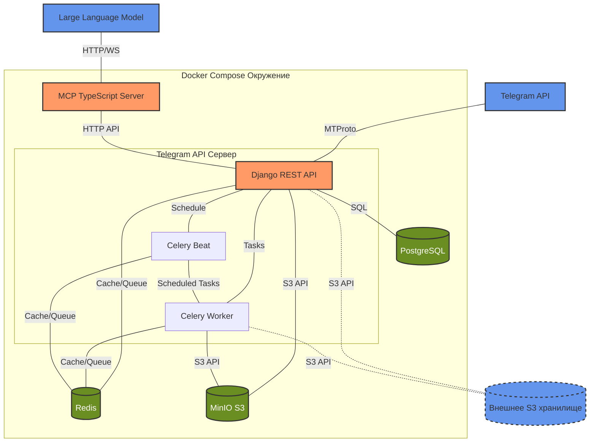
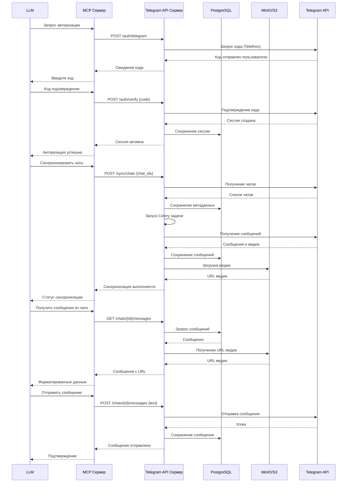
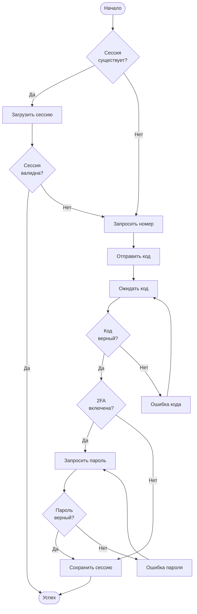
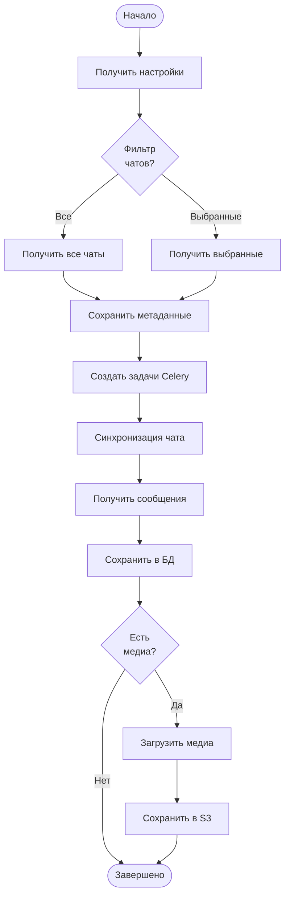

Рад, что тебе в целом нравится предложенная архитектура! Я переработаю её, чтобы она больше соответствовала структуре и стилю, которые ты указал в своём примере. Вот обновлённая версия архитектуры системы интеграции Telegram с MCP, с акцентом на схемы Mermaid, чёткие потоки данных и подробное описание компонентов.

---

# Архитектура системы интеграции Telegram с MCP

## Схема архитектуры

Ниже представлена общая схема системы, которая отражает взаимодействие компонентов в Docker Compose окружении:



## Общий подход

Система разделена на два основных компонента с чётким разделением ответственности:

1. **Telegram API Сервер** — бэкенд на Django REST Framework (DRF), который:
   - Взаимодействует с Telegram API через MTProto (с использованием Telethon).
   - Предоставляет REST API для MCP Сервера.
   - Обрабатывает асинхронные задачи (например, синхронизацию чатов) через Celery.

2. **MCP Сервер** — прослойка на TypeScript, которая:
   - Связывает LLM с Telegram API Сервером через HTTP API.
   - Предоставляет инструменты для авторизации, работы с чатами, сообщениями и медиа.
   - Использует LangChain для интеграции с LLM.

Такой подход обеспечивает:
- Надёжность и масштабируемость за счёт DRF и Celery.
- Гибкость в управлении доступом LLM к Telegram через MCP.
- Асинхронную обработку тяжёлых операций (например, загрузка медиа).

---

## Потоки данных

Потоки данных описывают ключевые сценарии взаимодействия между компонентами:



---

## Ключевые алгоритмы

### 1. Алгоритм авторизации в Telegram



### 2. Алгоритм синхронизации чатов



---

## Компоненты системы

### 1. Telegram API Сервер (Django REST Framework)

#### Основные компоненты:
- **Аутентификация и авторизация**:
  - Поддержка авторизации через номер телефона или QR-код (Telethon).
  - Сохранение сессий в PostgreSQL.
  - API ключи для MCP Сервера.
  - Permissions в DRF для контроля доступа.

- **Модуль синхронизации**:
  - Импорт всех или выбранных чатов.
  - Асинхронная синхронизация через Celery.
  - Webhook или Long Polling для новых сообщений.

- **База данных**:
  - Модели: чаты, сообщения, пользователи, медиа, сессии.
  - Хранение истории синхронизации.

- **Медиа обработчик**:
  - Загрузка в MinIO или внешнее S3 (Boto3).
  - Опциональное преобразование медиа.
  - Кэширование в Redis.

- **API Endpoints**:
  - `GET /chats` — список чатов.
  - `POST /sync/chats` — запуск синхронизации.
  - `GET /chats/{id}/messages` — получение сообщений.
  - `POST /chats/{id}/messages` — отправка сообщения.

- **Throttling и безопасность**:
  - Ограничение запросов через DRF Throttling.
  - Фильтры по IP и User-Agent.
  - Логирование с помощью `loguru`.

#### Технический стек:
- Django 5.1
- Django REST Framework 3.15
- Telethon 1.36
- Celery 5.4 + Redis 5.0
- PostgreSQL 16
- Boto3 для S3
- Pydantic 2.9 для валидации
- OpenAPI для документации

#### Фильтры для Telegram Parser:
- Максимальный размер файла (`MAX_FILE_SIZE`).
- Типы файлов (фото, видео, документы).
- Ключевые слова и хэштеги.
- Диапазон дат (`offset_date`).
- Список чатов (`chat_ids`).

---

### 2. MCP Сервер (TypeScript SDK)

#### Основные компоненты:
- **Клиент Telegram API Сервера**:
  - HTTP-запросы через Axios.
  - Обработка ошибок и повторные попытки.

- **Инструменты MCP**:
  - `telegram_auth` — авторизация.
  - `telegram_chats` — управление чатами.
  - `telegram_messages` — работа с сообщениями.
  - `telegram_media` — обработка медиа.
  - `telegram_search` — поиск.
  - `telegram_monitor` — мониторинг.

- **Менеджер инструментов**:
  - Динамическая активация инструментов.
  - Конфигурация через JSON.

- **Управление состоянием**:
  - Кэширование в Redis через LangChain.js.
  - Хранение истории запросов.

#### Технический стек:
- TypeScript 5.5
- Axios 1.7
- Winston 3.14 для логирования
- LangChain.js для LLM

---

## Хранение данных

- **PostgreSQL**:
  - Чаты, сообщения, пользователи, сессии.
- **Redis**:
  - Кэш, очереди Celery.
- **MinIO**:
  - Локальное S3-хранилище для медиа.
- **MCP Сервер**:
  - Временный кэш и конфигурация.

---

## Контейнеризация и развертывание

### Docker Compose
- **Сервисы**:
  - `telegram-api` (Django REST API).
  - `celery-worker` и `celery-beat`.
  - `mcp-server` (TypeScript).
  - `postgres`, `redis`, `minio`.

### Запуск
```bash
docker-compose up -d
```

---

## Безопасность

- API ключи между MCP и Telegram API Сервером.
- Throttling в DRF.
- Базовое логирование (Winston и `loguru`).

---

Если что-то нужно доработать или уточнить, дай знать!
